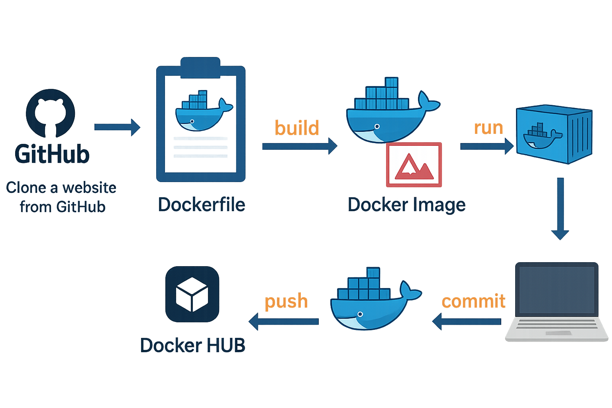
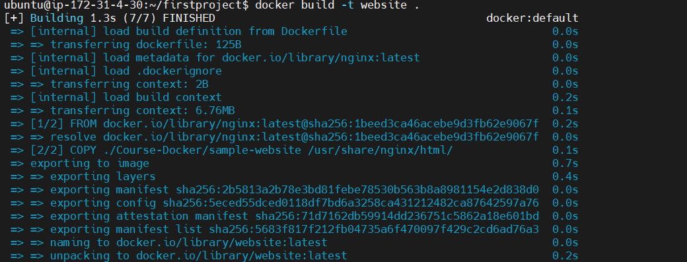
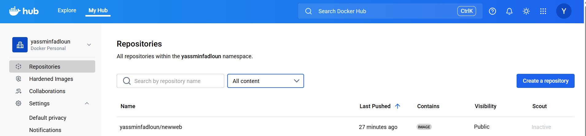

# Website Deployment Using GitHub and Docker

This project demonstrates a complete workflow for deploying a website using GitHub and Docker.
The repository includes a Dockerfile and instructions for building, running, committing, and pushing a Docker image to Docker Hub.

---

## Project Architecture



## Project Overview

This workflow represents a typical CI/CD-ready container pipeline that includes:

1.  **Cloning source code from GitHub**
2.  **Creating a Dockerfile**
3.  **Building a Docker image**
4.  **Running a container locally**
5.  **Committing changes to the container image**
6.  **Pushing the image to Docker Hub**

The steps are visually represented in the system architecture diagram available in this repository.

---

## Repository Structure

```bash
.
├── Dockerfile
└── README.md
```
## Step-by-Step Workflow

### 1. Clone a Website from GitHub
```bash
$ git clone https://github.com/MenaMagdyHalem/Course-Docker.git
```
### 2. Create a [Dockerfile](./Dockerfile)


```bash
$ vim Dockerfile
```

### 3. Build the image from the Dockerfile
```bash
$ docker build -t webserver
```


### 4. Run the image, mapping port 8080 to port 80
```bash
$ docker run -it --rm -d -p 8080:80 --name web webserver
```
#### 5. Access it in your browser:
```bash
http://localhost:8080
```


### 6. Commit the image
```bash
docker commit web yassminfadloun/newweb
```
### 7. Push the Image to Docker Hub

#### Log in:
```bash
docker login
```
#### Push:
```bash
docker push yassminfadloun/newweb:latest
```


